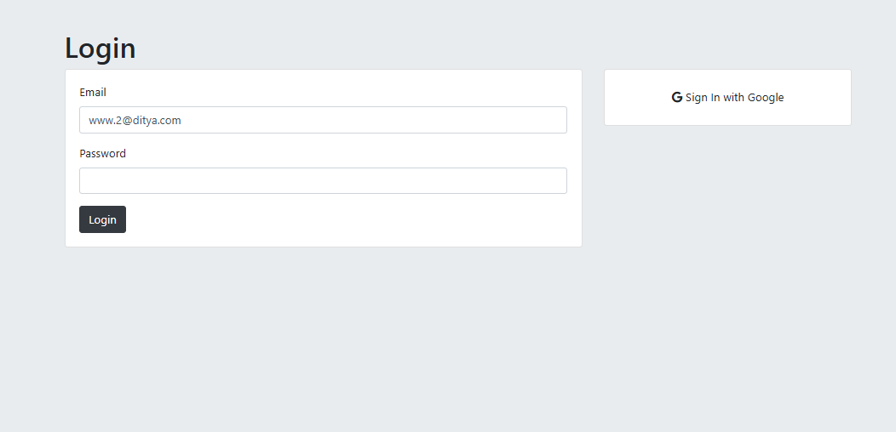
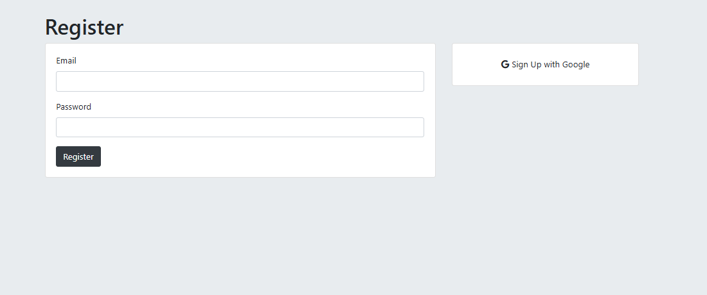
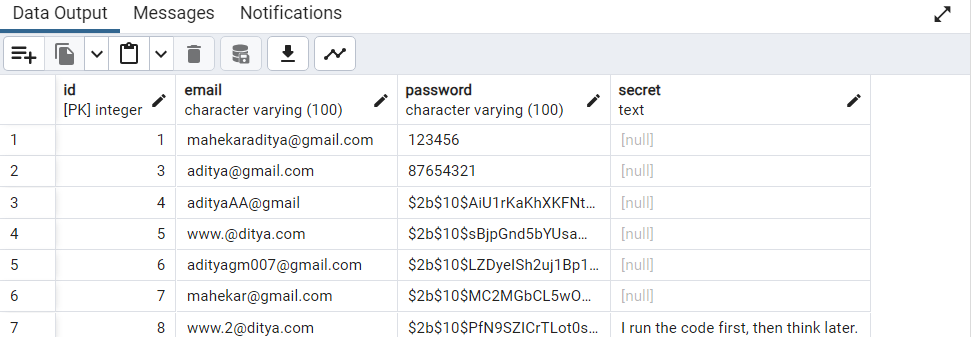

# 🔐 Authorized Secret Storing Web

This project is a simple secret-storing platform built with Node.js, Express, EJS, and PostgreSQL.  
It allows users to register, log in, and store their secrets securely.

---
The project follows a modular EJS structure using partials (header.ejs, footer.ejs) and serves static assets through the public/ folder.<br>

---

## 📷 Gallery

| SignUp Page | Login Page |
|----|------------|
|  |  |

| Register Page | Secret Page |
|----------------|-----------------|
|  |  |

| Database | Stored Secrets |
|-------------------|-------------------|
|  |  |

---

## ⚙️ Setup Instructions

1️⃣ Create Table in PostgreSQL (`users`):  
 <br>
as given in the `query.sql` file  
 <br> <br>
 
2️⃣ Install Dependencies:
```bash
npm i
npm i pg express ejs body-parser
```

3️⃣  Edit .env file: <br>
as give in the .ENV.txt <br> <br>

4️⃣ Run Server:
```bash
node index.js
```
---
👉 [Open App on Localhost](http://localhost:3000)
